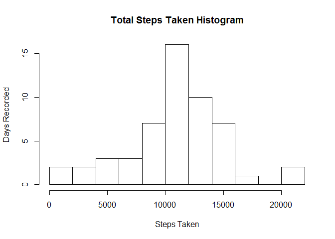
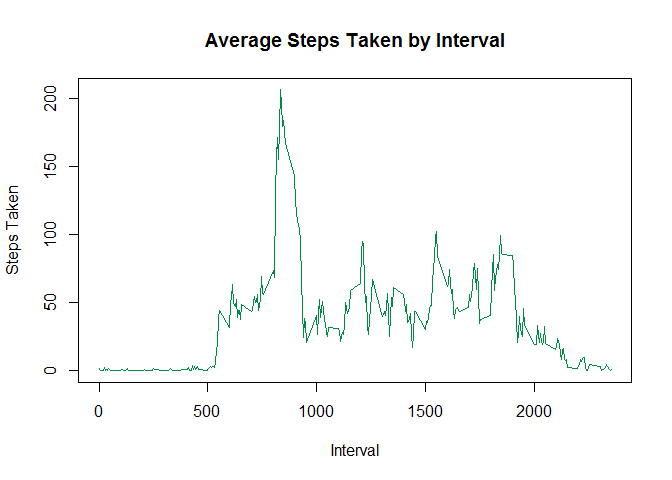
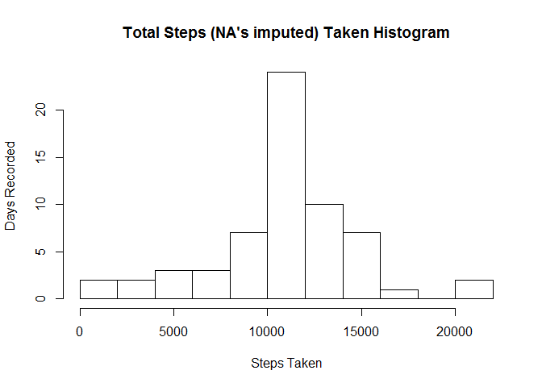
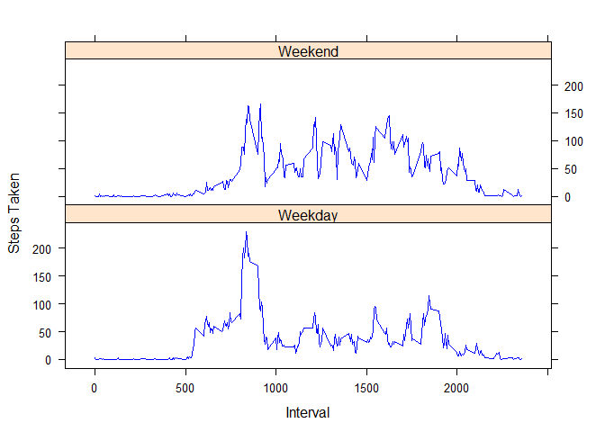

# Reproducible Research: Peer Assessment 1

## Loading and preprocessing the data

Unzip the data archive then load the data using **read.csv**:


```r
setwd("D:/Repo/RepData_PeerAssessment1")
unzip("activity.zip")
activity <- read.csv("activity.csv")
```

Convert the date column into Date variables. This preprocessing step is needed to for further calculations:


```r
activity$date <- as.Date(activity$date)
```

Calculate **total steps taken per each day**. (The results are assigned to *total.steps* for use in the histogram that follows).

```r
total.steps <- aggregate(activity$steps, by = list(activity$date), FUN = sum)
total.steps
```

```
##       Group.1     x
## 1  2012-10-01    NA
## 2  2012-10-02   126
## 3  2012-10-03 11352
## 4  2012-10-04 12116
## 5  2012-10-05 13294
## 6  2012-10-06 15420
## 7  2012-10-07 11015
## 8  2012-10-08    NA
## 9  2012-10-09 12811
## 10 2012-10-10  9900
## 11 2012-10-11 10304
## 12 2012-10-12 17382
## 13 2012-10-13 12426
## 14 2012-10-14 15098
## 15 2012-10-15 10139
## 16 2012-10-16 15084
## 17 2012-10-17 13452
## 18 2012-10-18 10056
## 19 2012-10-19 11829
## 20 2012-10-20 10395
## 21 2012-10-21  8821
## 22 2012-10-22 13460
## 23 2012-10-23  8918
## 24 2012-10-24  8355
## 25 2012-10-25  2492
## 26 2012-10-26  6778
## 27 2012-10-27 10119
## 28 2012-10-28 11458
## 29 2012-10-29  5018
## 30 2012-10-30  9819
## 31 2012-10-31 15414
## 32 2012-11-01    NA
## 33 2012-11-02 10600
## 34 2012-11-03 10571
## 35 2012-11-04    NA
## 36 2012-11-05 10439
## 37 2012-11-06  8334
## 38 2012-11-07 12883
## 39 2012-11-08  3219
## 40 2012-11-09    NA
## 41 2012-11-10    NA
## 42 2012-11-11 12608
## 43 2012-11-12 10765
## 44 2012-11-13  7336
## 45 2012-11-14    NA
## 46 2012-11-15    41
## 47 2012-11-16  5441
## 48 2012-11-17 14339
## 49 2012-11-18 15110
## 50 2012-11-19  8841
## 51 2012-11-20  4472
## 52 2012-11-21 12787
## 53 2012-11-22 20427
## 54 2012-11-23 21194
## 55 2012-11-24 14478
## 56 2012-11-25 11834
## 57 2012-11-26 11162
## 58 2012-11-27 13646
## 59 2012-11-28 10183
## 60 2012-11-29  7047
## 61 2012-11-30    NA
```

Plot the **histogram** showing steps taken and the frequencies (in number of days recorded):

```r
hist(total.steps$x, breaks = 10, xlab = "Steps Taken", ylab = "Days Recorded", main = "Total Steps Taken Histogram")
```

 

## What is mean total number of steps taken per day?

**Mean** of the total number of steps taken per day

```r
mean(total.steps$x, na.rm = TRUE)
```

```
## [1] 10766.19
```

**Median** of the total number of steps taken per day

```r
median(total.steps$x, na.rm = TRUE)
```

```
## [1] 10765
```

## What is the average daily activity pattern?

Calculate average number of steps across days for each interval, then plot the time series:

```r
interval.avg <- aggregate(activity$steps, by = list(activity$interval), FUN = mean, na.rm = TRUE)
plot(x ~ Group.1, data = interval.avg, type = "l", xlab = "Interval", ylab = "Steps Taken", col = "springgreen4")
title("Average Steps Taken by Interval")
```

 

The 5-minute **interval contains the maximum number of steps** on average,

```r
interval.avg[which(interval.avg$x == max(interval.avg$x)), 1]
```

```
## [1] 835
```

## Imputing missing values

Total number of missing values:


```r
sum(is.na(activity$step))
```

```
## [1] 2304
```

I will use the **average** number of steps per interval to fill in the NA's.

Create a new data set called *activity2* by loading the csv file:

```r
setwd("D:/Repo/RepData_PeerAssessment1")
activity2 <- read.csv("activity.csv")
activity2$date <- as.Date(activity2$date)
```

Then add the imputed values for *steps* where the original *steps* values are missing:

```r
for (i in which(is.na(activity2$steps))) {
  activity2[i, "steps"]  <- interval.avg[which(interval.avg$Group.1 == activity2[i, "interval"]), "x"]
}
```

Now create the histogram plot for the imputed step values:

```r
total.steps2 <- aggregate(activity2$steps, by = list(activity$date), FUN = sum)
hist(total.steps2$x, breaks = 10, xlab = "Steps Taken", ylab = "Days Recorded", main = "Total Steps (NA's imputed) Taken Histogram")
```

 

**Mean** of the total number of steps (with NA's imputed) taken per day

```r
mean(total.steps2$x, na.rm = TRUE)
```

```
## [1] 10766.19
```

**Median** of the total number of steps (with NA's imputed) taken per day

```r
median(total.steps2$x, na.rm = TRUE)
```

```
## [1] 10766.19
```

So the mean remains the same as before imputing, but the median has slightly changed (was 10765 originally).

## Are there differences in activity patterns between weekdays and weekends?
Adding variable *Day of week*


```r
activity2$dow <- ifelse (weekdays(activity2$date) == "Saturday" | weekdays(activity2$date) == "Sunday", "Weekend", "Weekday")
```

Initialize the plotting

```r
library(lattice)
interval.avg2 <- aggregate(activity2$steps, by = list(activity2$interval, activity2$dow), FUN = mean, na.rm = TRUE)
```

Panel plots for comparison between weekdays and weekends:

```r
xyplot(x ~ Group.1 | Group.2, data = interval.avg2, type = "l", xlab = "Interval", ylab = "Steps Taken", layout = c(1, 2), col = "blue")
```

 

