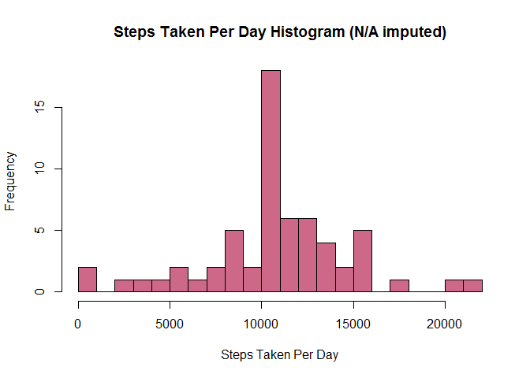

# Reproducible Research: Peer Assessment 1

Load the needed packages

```r
require(dplyr)
require(lubridate)
require(stringr)
require(ggplot2)
require(scales)
```

## Loading and preprocessing the data

Unzip the data archive then load the data using **read.csv**. This assumes that there is a file named "activity.zip" in working directory:


```r
unzip("activity.zip")
activity <- read.csv("activity.csv")
```
Convert the date column into Date variables. This preprocessing step is needed to for further calculations:

```r
activity$date <- as.Date(activity$date)
```


Calculate **total steps taken per each day**. (The results are assigned to *steps.per.day* for use in the histogram that follows).

```r
activity <- tbl_df(activity)
by_day <- activity %>% group_by(date) %>% filter(!is.na(steps))
steps.per.day <- summarise(by_day, steps.taken = sum(steps, na.rm = TRUE))
print.data.frame(steps.per.day)
```

```
##          date steps.taken
## 1  2012-10-02         126
## 2  2012-10-03       11352
## 3  2012-10-04       12116
## 4  2012-10-05       13294
## 5  2012-10-06       15420
## 6  2012-10-07       11015
## 7  2012-10-09       12811
## 8  2012-10-10        9900
## 9  2012-10-11       10304
## 10 2012-10-12       17382
## 11 2012-10-13       12426
## 12 2012-10-14       15098
## 13 2012-10-15       10139
## 14 2012-10-16       15084
## 15 2012-10-17       13452
## 16 2012-10-18       10056
## 17 2012-10-19       11829
## 18 2012-10-20       10395
## 19 2012-10-21        8821
## 20 2012-10-22       13460
## 21 2012-10-23        8918
## 22 2012-10-24        8355
## 23 2012-10-25        2492
## 24 2012-10-26        6778
## 25 2012-10-27       10119
## 26 2012-10-28       11458
## 27 2012-10-29        5018
## 28 2012-10-30        9819
## 29 2012-10-31       15414
## 30 2012-11-02       10600
## 31 2012-11-03       10571
## 32 2012-11-05       10439
## 33 2012-11-06        8334
## 34 2012-11-07       12883
## 35 2012-11-08        3219
## 36 2012-11-11       12608
## 37 2012-11-12       10765
## 38 2012-11-13        7336
## 39 2012-11-15          41
## 40 2012-11-16        5441
## 41 2012-11-17       14339
## 42 2012-11-18       15110
## 43 2012-11-19        8841
## 44 2012-11-20        4472
## 45 2012-11-21       12787
## 46 2012-11-22       20427
## 47 2012-11-23       21194
## 48 2012-11-24       14478
## 49 2012-11-25       11834
## 50 2012-11-26       11162
## 51 2012-11-27       13646
## 52 2012-11-28       10183
## 53 2012-11-29        7047
```

Plot the **histogram** showing steps taken and the frequencies (in number of days recorded):

```r
hist(steps.per.day$steps.taken, breaks = 20, col = "palevioletred3", xlab = "Steps Taken Per Day", main = "Steps Taken Per Day Histogram")
```

 

## What is mean total number of steps taken per day?

**Mean** of the total number of steps taken per day

```r
mean(steps.per.day$steps.taken)
```

```
## [1] 10766.19
```

**Median** of the total number of steps taken per day

```r
median(steps.per.day$steps.taken)
```

```
## [1] 10765
```

## What is the average daily activity pattern?

Calculate average number of steps across days for each interval

```r
by_interval <- activity %>% group_by(interval) %>% filter(!is.na(steps))
steps.per.interval <- summarise(by_interval, mean.steps.taken = mean(steps))
```

There would be gaps of data if we plot *interval* as numeric on the x-axis (e.g. R will think that there will be 45 mins gap between 5:55 to 6:00). So we first need to change *interval* to datetime. The date 2015-03-15 is a dummy date to use with *ymd_hm* and will be removed with *scale_x_datetime* later.

```r
steps.per.interval <- mutate(steps.per.interval, interval.series = ymd_hm(paste("2015-03-15", str_pad(interval, 4, pad = "0"))))
```

Now it's time for plotting. First, let's format the font for the axis labels and the title.


```r
bold_blue_text <- element_text(face = "bold", color = "blue", size = 12)
```
Then actually plot it.

```r
ggplot(steps.per.interval, aes(x = interval.series, y = mean.steps.taken)) + 
  geom_line() + scale_x_datetime(labels = date_format("%H:%M"), breaks = date_breaks("2 hour"), minor_breaks = date_breaks("1 hour")) +
    labs(title = "Daily Activity Pattern", x = "Interval", y = "Mean Steps Taken") + 
      theme(title = bold_blue_text, axis.title = bold_blue_text)
```

 


The 5-minute **interval contains the maximum number of steps** on average,

```r
steps.per.interval[which(steps.per.interval$mean.steps.taken == max(steps.per.interval$mean.steps.taken)), 1]
```

```
## Source: local data frame [1 x 1]
## 
##   interval
## 1      835
```
So people are most active at 8:35 am daily.

## Imputing missing values

Total number of missing values:


```r
sum(is.na(activity$step))
```

```
## [1] 2304
```

I will use the **average** number of steps per interval to fill in the NA's.

Create a new data set called *activity2* by copying from *activity*:

```r
activity2 <- activity
```

Then add the imputed values for *steps* where the original *steps* values are missing. Note that we are rounding up the imputed value because "observed" steps taken should be in whole numbers.

```r
for (i in which(is.na(activity2$steps))) {
  activity2[i, "steps"]  <- round(steps.per.interval[which(steps.per.interval$interval == activity2[i, ][["interval"]]), "mean.steps.taken"], digits = 0)
}
```

Now calculate total steps taken per day for the data with the imputed values:

```r
by_day2 <- activity2 %>% group_by(date)
steps.per.day2 <- summarise(by_day2, steps.taken = sum(steps))
print.data.frame(steps.per.day2)
```

```
##          date steps.taken
## 1  2012-10-01       10762
## 2  2012-10-02         126
## 3  2012-10-03       11352
## 4  2012-10-04       12116
## 5  2012-10-05       13294
## 6  2012-10-06       15420
## 7  2012-10-07       11015
## 8  2012-10-08       10762
## 9  2012-10-09       12811
## 10 2012-10-10        9900
## 11 2012-10-11       10304
## 12 2012-10-12       17382
## 13 2012-10-13       12426
## 14 2012-10-14       15098
## 15 2012-10-15       10139
## 16 2012-10-16       15084
## 17 2012-10-17       13452
## 18 2012-10-18       10056
## 19 2012-10-19       11829
## 20 2012-10-20       10395
## 21 2012-10-21        8821
## 22 2012-10-22       13460
## 23 2012-10-23        8918
## 24 2012-10-24        8355
## 25 2012-10-25        2492
## 26 2012-10-26        6778
## 27 2012-10-27       10119
## 28 2012-10-28       11458
## 29 2012-10-29        5018
## 30 2012-10-30        9819
## 31 2012-10-31       15414
## 32 2012-11-01       10762
## 33 2012-11-02       10600
## 34 2012-11-03       10571
## 35 2012-11-04       10762
## 36 2012-11-05       10439
## 37 2012-11-06        8334
## 38 2012-11-07       12883
## 39 2012-11-08        3219
## 40 2012-11-09       10762
## 41 2012-11-10       10762
## 42 2012-11-11       12608
## 43 2012-11-12       10765
## 44 2012-11-13        7336
## 45 2012-11-14       10762
## 46 2012-11-15          41
## 47 2012-11-16        5441
## 48 2012-11-17       14339
## 49 2012-11-18       15110
## 50 2012-11-19        8841
## 51 2012-11-20        4472
## 52 2012-11-21       12787
## 53 2012-11-22       20427
## 54 2012-11-23       21194
## 55 2012-11-24       14478
## 56 2012-11-25       11834
## 57 2012-11-26       11162
## 58 2012-11-27       13646
## 59 2012-11-28       10183
## 60 2012-11-29        7047
## 61 2012-11-30       10762
```

Plot the histogram, this time with imputed values added:

```r
hist(steps.per.day2$steps.taken, breaks = 20, col = "palevioletred3", xlab = "Steps Taken Per Day", main = "Steps Taken Per Day Histogram (N/A imputed)")
```

 

**Mean** of the total number of steps (with NA's imputed) taken per day

```r
mean(steps.per.day2$steps.taken)
```

```
## [1] 10765.64
```

**Median** of the total number of steps (with NA's imputed) taken per day

```r
median(steps.per.day2$steps.taken)
```

```
## [1] 10762
```

So both the mean and the median have slightly changed.

## Are there differences in activity patterns between weekdays and weekends?
Adding variable *Day of week*


```r
activity2$dow <- ifelse (weekdays(activity2$date) == "Saturday" | weekdays(activity2$date) == "Sunday", "Weekend", "Weekday")
```
Let's see if our function worked:

```r
table(activity2$dow)
```

```
## 
## Weekday Weekend 
##   12960    4608
```

Good. Now calculate average number of steps across days for each interval. As before, remember to change the interval to time values.

```r
by_interval2 <- activity2 %>% group_by(interval, dow)
steps.per.interval2 <- summarise(by_interval2, mean.steps.taken = mean(steps))
steps.per.interval2 <- mutate(steps.per.interval2, interval.series = ymd_hm(paste("2015-03-15", str_pad(interval, 4, pad = "0"))))
```

Panel plots for comparison between weekdays and weekends:


```r
ggplot(steps.per.interval2, aes(x = interval.series, y = mean.steps.taken)) + 
  geom_line() + scale_x_datetime(labels = date_format("%H:%M"), breaks = date_breaks("2 hour"), minor_breaks = date_breaks("1 hour")) +
    labs(title = "Daily Activity Pattern", x = "Interval", y = "Mean Steps Taken") + 
      theme(title = bold_blue_text, axis.title = bold_blue_text) + 
        facet_wrap(~ dow, ncol=1)
```

 

So it looks like activites are higher during weekends and they are less extreme like during week days.
